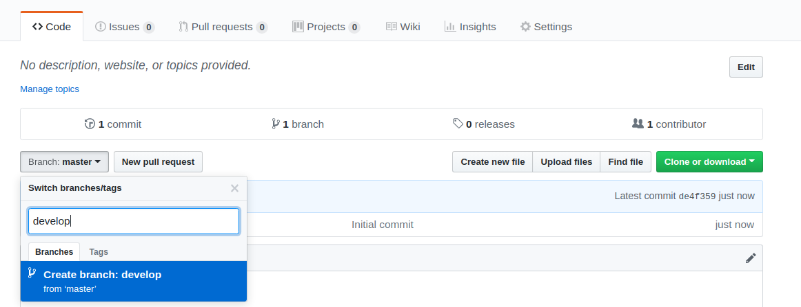
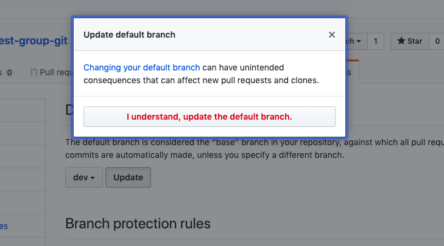
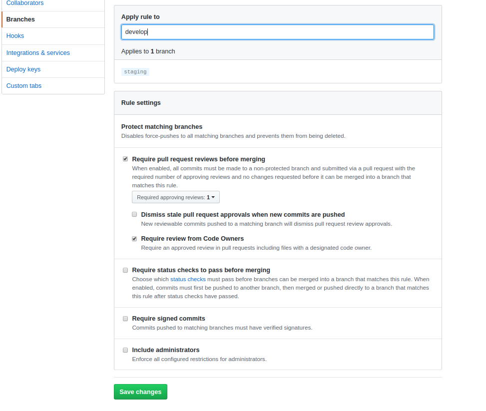
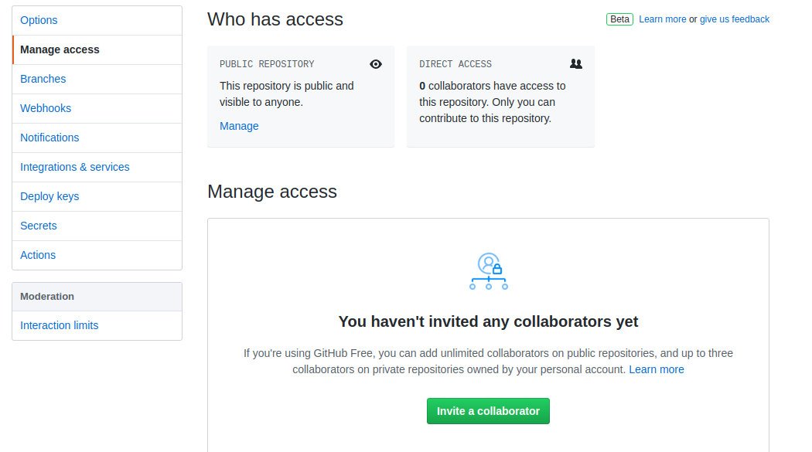
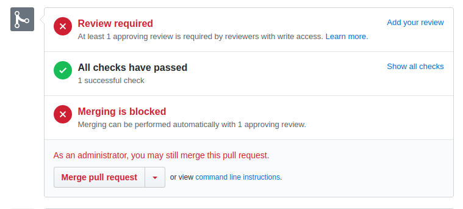
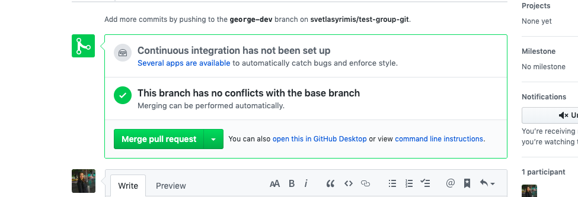

#   SOFTWARE ENGINEERING IMMERSIVE


# Group Git

## [Git Docs](https://www.git-scm.com/docs)

Once settled in your groups decide who will be the Team Leader
*********
### Team Leader does:

1. On GitHub(personal GitHub **NOT** Enterprise) make a project repo called `git-group-practice`. Make it public and initialize a README).
     
2. Add a develop branch on your remote repository 
# 

3. Now that you have a remote `dev` branch let's go ahead and set it as the **default** branch of our repository. 

4. Your default branch is named `master`. If you have admin rights over a repository on GitHub, you can change the default branch on the repository. [Setting the default branch](https://help.github.com/en/github/administering-a-repository/setting-the-default-branch)

5. In Settings, in the left menu, click Branches.

Update the `dev` to be the default branch.

6. Create branch protection rules  
- Click on settings and then branches
- Add rule to dev branch    
- Check Require pull request reviews before merging
- Check Require view from Code Owners   
- Save Changes   

# 

7. Share the git repo link with your team in slack.

8. In Settings, under Collaborators, add your team members. (the UI has changed since this pic was made, Manage Access is now labeled Collaborators)

 # 

9. Your team members should have received an invitation to collaborate via email.

10. **Clone** the repo to your local machine. It's your own repo so **Do not fork.** `cd` into the `git-group-practice` directory.
 
 

<!--  -->

<br><hr>

### The rest of the members:

1. **Clone** the repo to your local machine. **Do not fork.** `cd` into the `git-group-practice` directory.

2. Type `git branch -a` to see which branch you are on, as well as, your remotes. The branch you are on is supposed to have a `*` in front.

```
* dev
  master
```

3. Create a branch as yourname-dev 
```bash 
git checkout -b your-name-here-dev
``` 

4. Open the `README` in the text editor.

5. Make some changes in the `README`


6. Check to see which changes were made using `git status`. 


**It should look something like this:**

```
On branch svetla-dev
Changes not staged for commit:
  (use "git add <file>..." to update what will be committed)
  (use "git checkout -- <file>..." to discard changes in working directory)

	modified:   README.md

no changes added to commit (use "git add" and/or "git commit -a")
```

7. `git add README.md` for staging and then `git commit -m "add readme"`.

8. All members should push their changes.

  `git push origin your-name-here-dev`

9. On Github, under the Your Branches section, make a pull request using the new pull request button, base should be set to head and compare will be the yourname -dev. 

*OR*

- In the pull request tab, select New Pull Request, and then select base to be dev and compare will be the yourname-dev branch. Once confirmed click on Create Pull Request.


<br><hr>

### Team Leader Does:
1. On Github, click on the Pull Requests tab. You should see pull requests from all team members.

2. Review pull request
3. As Git Master you will see the following (pic below)
- (If you set things up correctly only the git master will be able to see the add your review option)

# 
4. Click on add your review
5. Once reviewed you will be able to merge the pull request

6. Merge it 

7. Select the next pull request and notice there is most likely a merge conflict. 

8. Request the team member to resolve the merge conflict.


<br><hr>
### Team member with a merge conflict

1. Make sure you are on yourname-dev

`git checkout your-name-here-dev`

2. Get the **latest changes** from `dev` by running `git pull origin dev` (very important step).

3. The text editor will highlight the merge conflict like so:

```
# git-group-practice
<<<<<<< HEAD
*YOUR VERSION*
=======
*What's currently on dev branch*
>>>>>>> commit hash
```

4. The objective is to have both your changes, so in this situation simply remove `<<<<<<< HEAD`, `=======` and `>>>>>>> commit hash`

5. The text editor may have the following options as well:


   You may choose to `Accept Both Changes`.

6. Add, commit and push your changes. 

7. Go back to GitHub, on Pull Request tab, select your Pull Request again and this time you should see: 



8. Inform the Team Leader that your code is ready to be merged.


9. Once the merge conflict is resolved, the Team Leader can merge it in.


<br><hr>
### Team Leader

After you have the changes from all members in the `dev` branch it is time we merge `dev` into `master`. 


1. `git checkout master`
2. `git pull origin dev`
3. `git merge dev`
<!-- The --no-ff flag causes the merge to always create a new commit object, even if the merge could be performed with a fast-forward. This avoids losing information about the historical existence of a feature branch and groups together all commits that together added the feature. -->
4. `git push origin master`


```
➜  test-group-git git:(dev) git checkout master
Switched to branch 'master'
Your branch is up to date with 'origin/master'.
➜  test-group-git git:(master) git merge dev
Updating 29fb49d..804ab70
Fast-forward
 README.md | 5 +----
 1 file changed, 1 insertion(+), 4 deletions(-)
➜  test-group-git git:(master) git push origin master
Total 0 (delta 0), reused 0 (delta 0)
To https://github.com/svetlasyrimis/test-group-git.git
   085148e..804ab70  master -> master
```

[e.g. A successful Git branching model](https://nvie.com/posts/a-successful-git-branching-model/)
### Important commands:
 `git checkout dev` — switch to the dev branch

 `git pull origin dev` — get the changes from the `dev` 

 `git checkout yourname-dev` — to switch your branch

 `git merge dev` — to merge dev changes into your branch 

 `git branch -d yourname-branch` [-d or -D ?](https://koukia.ca/delete-a-local-and-a-remote-git-branch-61df0b10d323) — Delete your remaining local branches
 
 `git push origin --delete remote-branch` — Delete the remote branches

 `git log --oneline --decorate --graph --all` to see the history of what we just did. 


You can read more at Github Help - [Administering a Repository](https://help.github.com/en/github/administering-a-repository)


 

